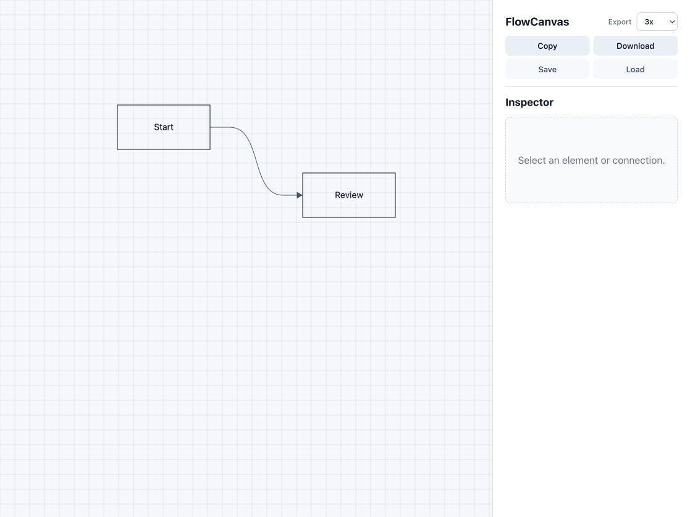

# FlowCanvas

FlowCanvas is a pure frontend flowchart editor built with Vue 3, Vite, TypeScript, and the native Canvas API. It focuses on a compact, usable MVP for drawing elements, connecting them, editing styles, exporting images, and saving/loading local flow documents.



## Features

- Create elements by clicking empty canvas space or pressing `N`.
- Select, drag, resize, and style elements on the canvas.
- Connect elements from side anchors with live preview.
- Switch connections between `Curve` and `Orthogonal` path styles.
- Orthogonal connections use simple routing and basic obstacle avoidance.
- Edit element shape, text, size mode, padding, alignment, fill, border, and border width.
- Edit connection line type, line width, dash pattern, arrow style, text, text position, and path style.
- Multi-select elements and connections with `Cmd`/`Ctrl`, including batch editing for shared properties.
- Support fixed-size wrapping, fit-content sizing, and multiline text for elements and connections.
- Export the selected content, or the whole board when nothing is selected, as PNG.
- Copy exported PNG to the clipboard or download it.
- Choose export scale from `1x`, `2x`, `3x`, or `4x`.
- Save and load `.flowcanvas.json` documents locally.

## Shortcuts

| Shortcut | Action |
| --- | --- |
| `N` | Add an element at the viewport center |
| `Cmd`/`Ctrl` + `A` | Select all elements and connections |
| `Cmd`/`Ctrl` + click | Toggle an item in the current selection |
| `Delete` / `Backspace` | Delete the current selection |
| `Cmd`/`Ctrl` + `Z` | Undo |
| `Shift` + `Cmd`/`Ctrl` + `Z` or `Cmd`/`Ctrl` + `Y` | Redo |
| `Space` + drag | Pan the canvas |
| Mouse wheel / trackpad scroll | Zoom around the pointer |
| `0` | Reset the viewport |

Keyboard shortcuts are ignored while typing in inputs, selects, textareas, or buttons.

## Getting Started

Install dependencies:

```bash
npm install
```

Start the dev server:

```bash
npm run dev
```

Build for production:

```bash
npm run build
```

Run the test suite:

```bash
npm test
```

Preview the production build:

```bash
npm run preview
```

## Project Structure

```text
src/
  App.vue              Main editor shell, UI state, pointer/keyboard interactions
  main.ts              Vue app entry
  styles.css           Application styling
  types/flow.ts        Core FlowCanvas types
  flow/
    defaults.ts        Default element and connection factories
    geometry.ts        Element sizing, snapping, routing, bounds, text layout
    hitTesting.ts      Canvas hit testing for elements, anchors, handles, connections
    render.ts          Canvas drawing for elements, connections, guides, export
    state.ts           Snapshot, history, selection, save/load, batch helpers
    *.test.ts          Focused unit tests for pure editor logic
```

## Design Notes

- FlowCanvas does not use a graph editor framework such as Vue Flow, X6, LogicFlow, or React Flow.
- Canvas rendering, geometry, hit testing, and state helpers are separated so the main Vue component can stay focused on orchestration.
- Connections default to curved paths for a softer authoring feel. Orthogonal paths are available per connection when structured diagram routing is preferred.
- Fit-content elements are measured from canvas text metrics and padding. Fixed-size elements wrap text within the content box.
- Save/load is local file based; there is no backend or account system.

## Verification

The current codebase includes unit coverage for:

- fit-content and multiline text measurement
- fixed-width text wrapping
- snapping and pointer movement thresholds
- connection path generation, preview routing, arrow angle, and obstacle avoidance
- selection, batch editing, history, save/load parsing, and export content selection
- render helpers for high-resolution export and hover/focus styling

